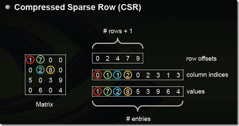

# SpMV

## 数据集地址

https://sparse.tamu.edu/

## 朴素的SpMV

标准的稀疏矩阵向量乘（Sparse Matrix-Vector Multiplication, SpMV）执行$$Y=\alpha A \cdot X + \beta Y$$
其中$A$是大小为$m\times k$的稀疏矩阵，$X$是大小为$k$的稠密向量，$Y$是大小为$m$的稠密向量，通常情况不考虑$Y$。

## CSR

```bash
nvcc spmv_csr.cu -lcusparse
./a.out SparseMatrix/xxx.mtx
```

<div align="center">
  
</div>

- 每个元素用`行偏移`和`（列号，数值）`来表示
    - 行偏移表示某一行的第一个元素在values里面的起始偏移位置
    - 第一行元素1是0偏移，第二行元素2是2偏移，第三行元素5是4偏移，第4行元素6是7偏移
    - 在行偏移的最后补上矩阵总的元素个数
        
### Answer

$$ Sparsity = nnz / (n\_rows * n\_cols)$$

| Dataset    | n_rows  | n_cols  | nnz     | Sparsity   |
|------------|---------|---------|---------|------------|
| airfoil_2d | 14,214  | 14,214  | 259,688 | 0.001285   |
| ASIC_100ks | 99,190  | 99,190  | 578,890 | 0.000059   |
| cage10     | 11,397  | 11,397  | 150,645 | 0.00116    |
| cavity21   | 4,562   | 4,562   | 138,187 | 0.00664    |
| coater2    | 9,540   | 9,540   | 207,308 | 0.002278   |
| hvdc1      | 24,842  | 24,842  | 159,981 | 0.000259   |
| lhr07      | 7,337   | 7,337   | 156,508 | 0.002907   |
| scircuit   | 170,998 | 170,998 | 958,936 | 0.000033   |

#### Time(ms) Comparison
| Algorithm       | airfoil_2d | ASIC_100ks | cage10    | cavity21  |
|-----------------|------------|------------|-----------|-----------|
| CPU             | 2.053513   | 5.975936   | 1.169246  | 1.005884  |
| CUSPARSE API    | 0.014398   | 0.018259   | 0.013626  | 0.013010  |
| Scalar GPU      | 0.006861   | 0.018827   | 0.006626  | 0.009791  |
| Vector GPU      | 0.007618   | 0.009028   | 0.004214  | 0.004191  |
| My GPU          | 0.008729   | 0.015188   | 0.005173  | 0.004653  |

#### Average Error Comparison

| Algorithm             | airfoil_2d | ASIC_100ks | cage10    | cavity21  |
|-----------------------|------------|------------|-----------|-----------|
| Scalar GPU vs CPU     | 0.001986   | 0.000003   | --        | --        |
| Scalar GPU vs CUSPARSE| 0.001986   | 0.000003   | --        | --        |
| Vector GPU vs CPU     | 0.002237   | 0.000002   | --        | --        |
| Vector GPU vs CUSPARSE| 0.002542   | 0.000003   | --        | --        |
| My GPU vs CPU         | 0.002237   | 0.000005   | --        | --        |
| My GPU vs CUSPARSE    | 0.002542   | 0.000003   | --        | --        |

## 参考
- https://github.com/peakcrosser7/spmv-samples
- https://github.com/Liu-xiandong/How_to_optimize_in_GPU/tree/master/spmv